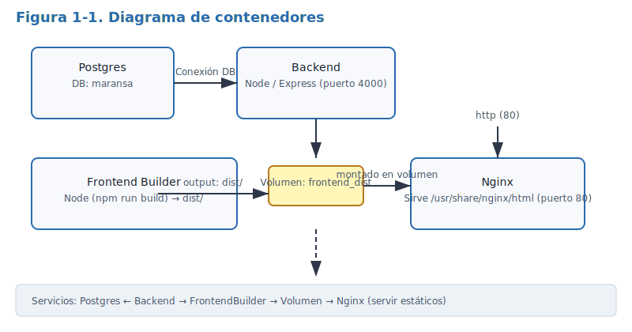
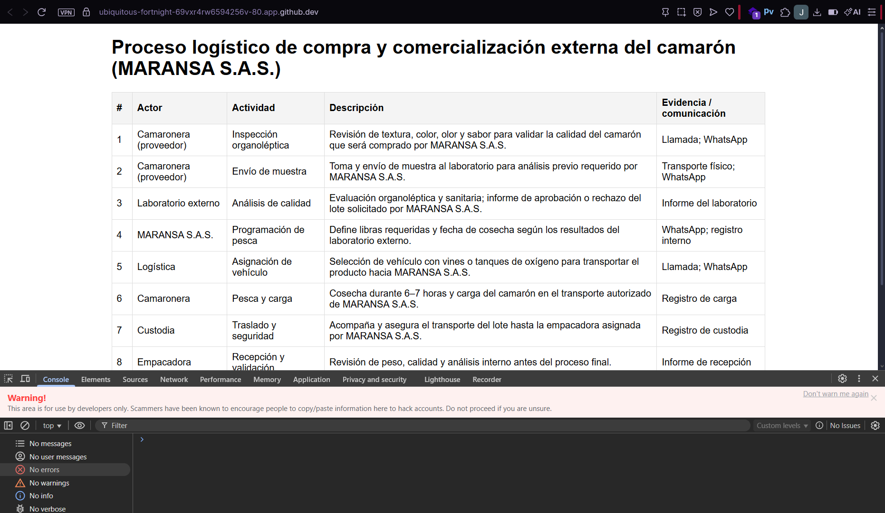
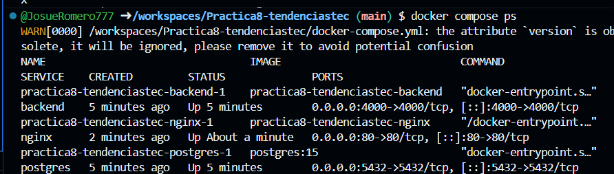
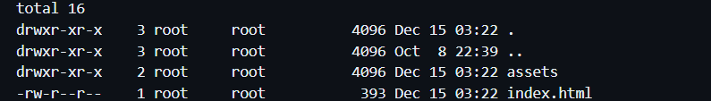
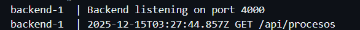

## 1. Título
Despliegue de la aplicación MARANSA en contenedores: frontend (Nginx), backend (Node/Express) y base de datos (Postgres)

## 2. Tiempo de duración
40 minutos 

## 3. Fundamentos
En esta práctica se despliega una aplicación web moderna usando contenedores. Se separan responsabilidades en tres capas: la base de datos (Postgres), el backend (Node/Express) y el frontend (aplicación React compilada con Vite). El frontend, en producción, se construye (build) con Node.js para generar archivos estáticos optimizados (HTML, CSS, JS minimizado). Estos archivos estáticos son servidos por un servidor web ligero y eficaz como Nginx, que ofrece mejor rendimiento y gestión de conexiones que un servidor de desarrollo.

La estrategia de despliegue empleada utiliza Docker y Docker Compose para orquestar servicios: un contenedor se encarga de construir la aplicación frontend usando una imagen de Node.js (proceso de build), y los artefactos resultantes se almacenan en un volumen nombrado compartido. Un segundo contenedor, basado en Nginx, monta ese volumen en `/usr/share/nginx/html` y entrega los activos al cliente. El backend se conecta a la base de datos Postgres a través de variables de entorno, lo que permite desacoplar la configuración del código.

Usar contenedores para separar la fase de build y la fase de entrega tiene ventajas claras: permite reproducibilidad (el build siempre ocurre en el mismo entorno), reduce el tamaño del contenedor que sirve los archivos (Nginx no trae herramientas de Node), acelera la entrega y facilita la escalabilidad horizontal del servicio web. Además, Docker Compose simplifica el levantamiento de todo el stack con un único comando `docker compose up` y define dependencias entre servicios.

Figura 1-1. Diagrama de contenedores (colocar en `img/diagram_contenedores.svg`, ancho máximo 800px).



## 4. Conocimientos previos
Para realizar esta práctica se requiere conocimiento de:
- Comandos básicos de Docker y Docker Compose (`docker build`, `docker run`, `docker compose up`)
- Manejo de terminal / consola (Linux/Windows/Mac)
- Fundamentos de HTTP y servidores web (Nginx)
- Node.js y administrador de paquetes `npm`
- Conceptos básicos de bases de datos relacionales y Postgres
- Uso de un navegador web para probar la aplicación

## 5. Objetivos a alcanzar
- Crear un Dockerfile para la construcción del frontend con Node.js.
- Crear un Dockerfile para la imagen Nginx que servirá los archivos estáticos.
- Integrar frontend, backend y base de datos con `docker-compose.yml` para un despliegue en producción.
- Documentar el procedimiento y generar evidencias de funcionamiento.

## 6. Equipo necesario
- Computador con sistema operativo Windows, Linux o Mac.
- Docker Engine y Docker Compose (instrucciones locales). Recomendado: Docker v20+.


## 7. Material de apoyo
- Documentación de Docker: https://docs.docker.com
- Documentación de Nginx: https://nginx.org
- Guía de React/Vite: https://vitejs.dev
- Cheat sheet de comandos Linux (local)

## 8. Procedimiento
Paso 1: Abrir el repositorio y revisar la estructura. Archivos principales: [docker-compose.yml](/docker-compose.yml), `backend/`, `frontend/`.

Paso 2: Construir y levantar los servicios (desde la raíz del repo):

```bash
docker compose up --build
```

Paso 3: El servicio `frontend_builder` ejecutará el proceso de build y escribirá los archivos estáticos en un volumen llamado `frontend_dist`. El servicio `nginx` los servirá en el puerto 80.

Paso 4: Verificar la aplicación en el navegador en `http://localhost` y comprobar que los datos del backend se muestran correctamente.

Figura 2-1. Resultado en el navegador


Figura 2-2. Estado de contenedores (`docker compose ps`)


Figura 2-3. Diagrama de contenedores


Figura 2-4. Archivos servidos por Nginx (`/usr/share/nginx/html`)


Figura 2-5. Logs del backend (peticiones a `/api/procesos`)



## 9. Resultados esperados
Al terminar la práctica se espera:
- Los contenedores `postgres`, `backend`, `frontend_builder` y `nginx` estén levantados (aunque `frontend_builder` puede finalizar tras completar el build).
- La aplicación web se sirva en `http://localhost` y muestre la tabla de procesos.


## 10. Bibliografía
- Docker Inc. (s.f.). Docker Documentation. https://docs.docker.com
- Nginx.org. (s.f.). Nginx Documentation. https://nginx.org


